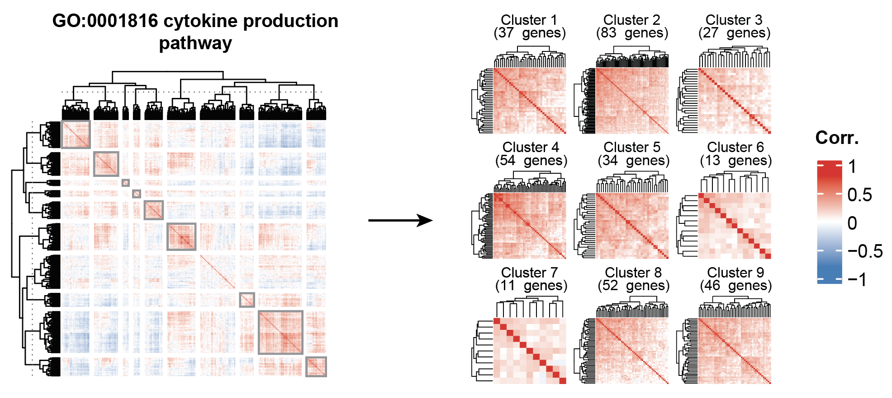

# GeneClusterer: Unsupervised Extraction of Highly Correlated Gene Subclusters

**GeneClusterer** is an R-based tool for unsupervised clustering of large-scale transcriptomic datasets. It identifies highly co-expressed gene modules using **correlation-based recursive splitting** and works with **microarray** or **RNA-seq normalized expression data**, including datasets such as **CCLE, GDSC, and TCGA**.

## Features
- **Supports multiple data types:** Microarray RMA or log2-transformed RNA-seq TPM/RPKM values.
- **Optional gene selection:** Analyze specific genes or use `--genes all` to include all genes.
- **FDR-based cutoff estimation:** Uses auto-shuffling to determine robust correlation thresholds.
- **Recursive cluster extraction:** Splits hierarchical dendrograms to find stable subclusters.
- **Clean outputs:** Generates CSV files per top-level cluster with removed genes labeled.

## Installation / Requirements
- **R ≥ 4.0**
- **Required R packages:** `optparse`, `stringr`

Install required packages if missing:

```r
install.packages(c("optparse", "stringr"))
```

## Usage

Run from the command line:

```bash
Rscript GeneClusterer.R --expression_data path/to/expression_matrix.csv --genes all --patience 25 --stabilization_threshold 0.01 --fdr 0.01 --out path/to/output_dir
```

### Arguments
- `--expression_data (-d)` : Path to CSV file with normalized expression values (rows = genes, columns = samples). **Required**
- `--genes (-g)` : Comma-separated list of genes to analyze, or `"all"` for all genes. **Optional, default = all**
- `--patience (-p)` : Termination patience for FDR cutoff estimation. **Default = 25**
- `--stabilization_threshold (-s)` : Threshold to stop auto-shuffle convergence. **Default = 0.01**
- `--fdr (-f)` : False discovery rate for cutoff estimation. **Default = 0.01**
- `--out (-o)` : Output directory for cluster CSVs. **Required**

## Input File Format
- CSV with **genes as rows** and **samples as columns**
- Values should be **normalized expression**:
  - Microarray: RMA values
  - RNA-seq: TPM/RPKM (log2-transformed recommended)

Example:

| Gene  | Sample1 | Sample2 | Sample3 |
|-------|---------|---------|---------|
| GeneA | 5.23    | 4.89    | 5.01    |
| GeneB | 2.13    | 2.45    | 2.21    |

## Output
- CSV files saved per **top-level dendrogram cluster**:
  - Filename: `tree_<cluster_id>.csv`
  - Columns: `id` (gene), `cluster` (assigned subcluster or `"Removed"`)

Example:

| id     | cluster |
|--------|---------|
| GeneA  | 1       |
| GeneB  | Removed |
| GeneC  | 2       |

## Example Illustration
An overview of the **GeneClusterer** workflow is shown below:



## Example Usage

Analyze **all genes** in `expression_matrix.csv` with default settings:

```bash
Rscript GeneClusterer.R --expression_data expression_matrix.csv --genes all --out ./clusters
```

Analyze a **subset of genes**:

```bash
Rscript GeneClusterer.R --expression_data expression_matrix.csv --genes TP53,BRCA1,MYC --out ./selected_clusters
```

## Notes
- Recommended for **medium to large datasets** (hundreds to thousands of genes)
- Spearman correlation is used, so **mean-centering is optional**
- FDR-based cutoff is estimated through shuffling; `patience` + `stabilization_threshold` control early stopping

## Reference
If you use **GeneClusterer** in your research, please cite:

> Wang, Sheng, et al. *Comparative analyses of gene networks mediating cancer metastatic potentials across lineage types.* **Briefings in Bioinformatics** 25.4 (2024): bbae357.  
> https://doi.org/10.1093/bib/bbae357

## License
**MIT License**
